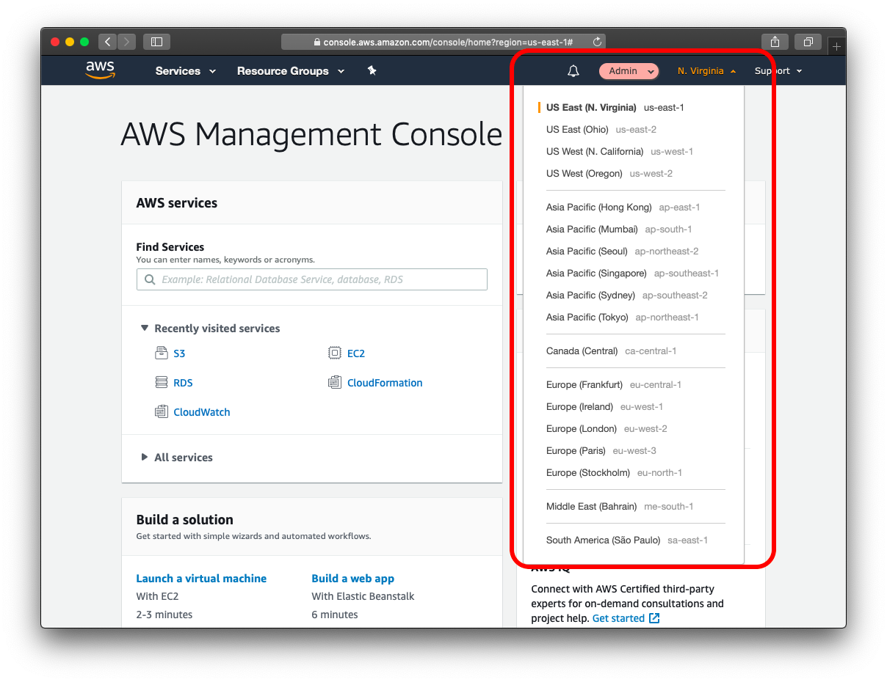
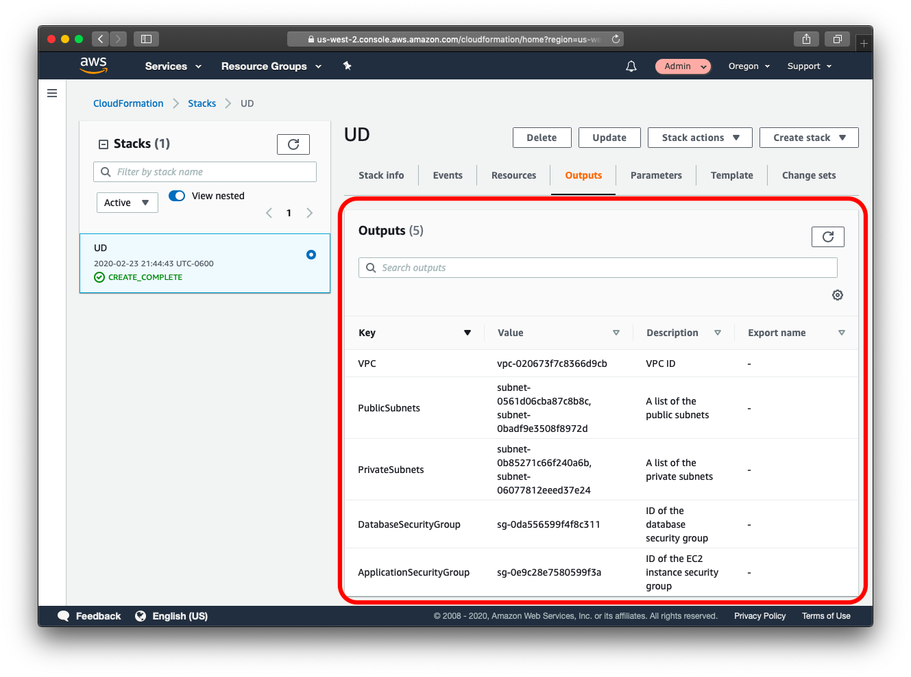
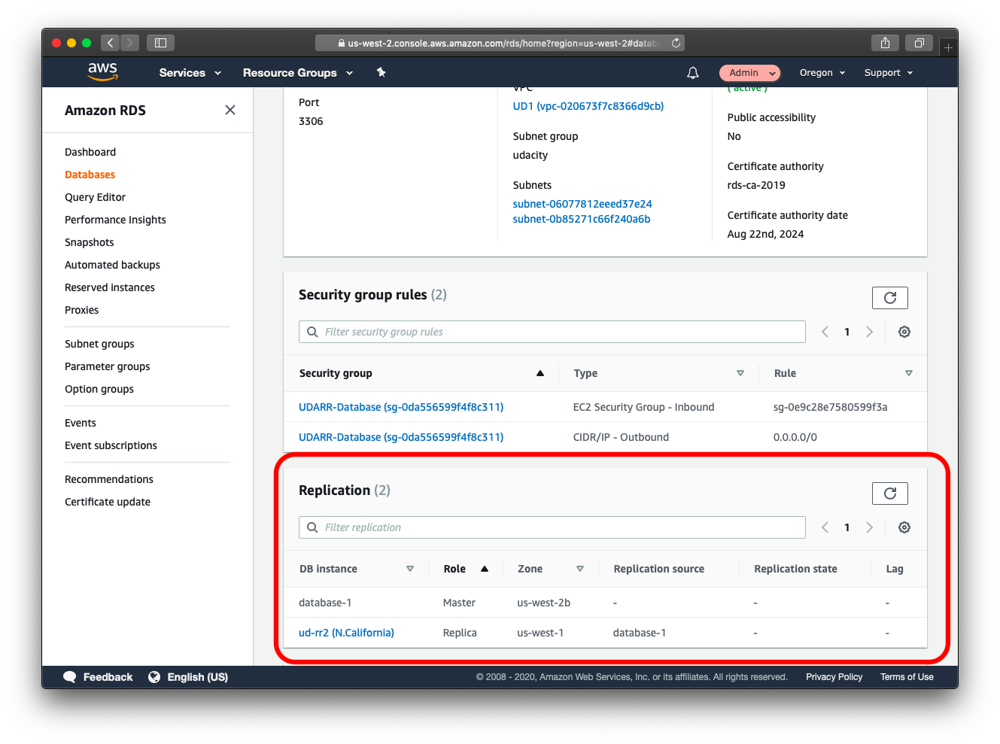
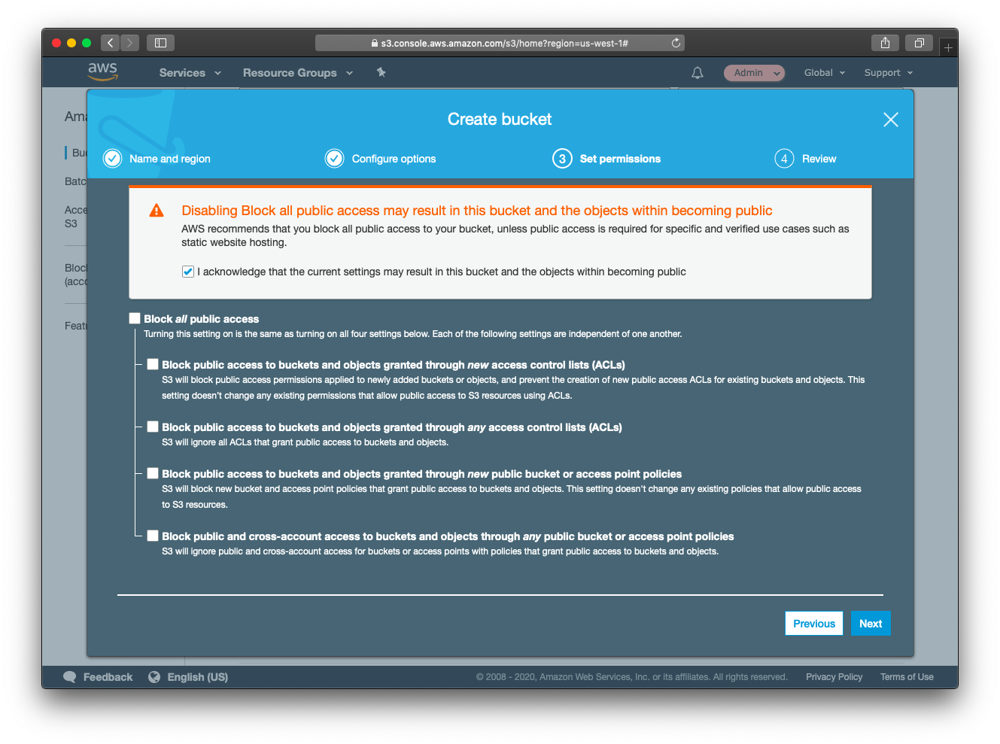
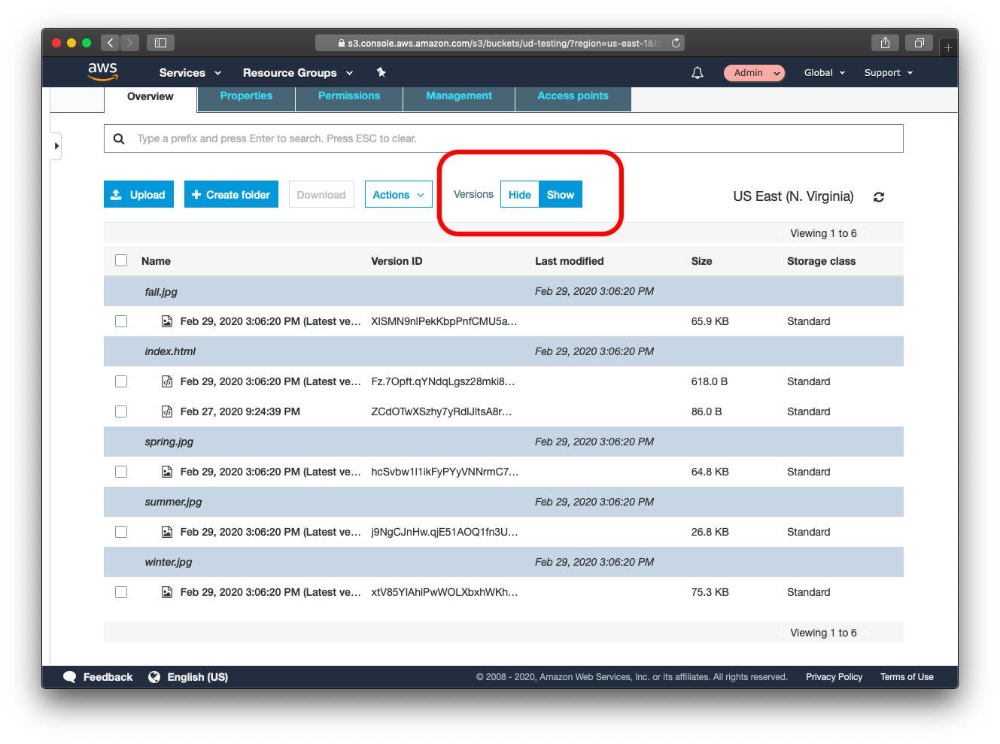

# Data durability and recovery

In this project you will create highly available solutions to common use cases.  You will build a Multi-AvailabilityZone, Multi-Region database and show how to use it in multiple geographically separate AWS regions.  You will also build a website hosting solution that is versioned so that any data destruction and accidents can be quickly and easily undone.

## Getting Started

To get started, clone this repo.  Aside from instructions, it contains a CloudFormation script to build an AWS VPC with public and private subnets.  It also contains an example website that you will host in an AWS S3 bucket in your account.

## Project Instructions

### Data durability and recovery
Create active and standby VPCs
In order to achieve the highest levels of durability and availability in AWS you must take advantage of multiple AWS regions.  The following will walk you through creating VPCs in multiple regions for this project.  Before you start, pick two AWS regions, one to be your “active” region, and one to be your “standby” region

1. Log into AWS account
2. Pick your “primary” region and set in AWS console

  

3. Services -> CloudFormation
4. Create stack “With new resources (standard)”

  

    1. Template is ready
    2. Upload a template file
    3. Click “Choose file” button
    4. Select provided YAML file
    5. Next
5. Fill in Stack name
6. Name the VPC “Primary”
7. Update the CIDR blocks
8. Click Next
9. Click Next again
10. Click Create stack
11. Wait for stack to build out.  Refresh until status becomes “CREATE_COMPLETE”
12. Observe the “Outputs” tab for the created IDs.  These will be used later.

  

13. Now pick your “standby” region and switch to it in the AWS console.
14. Repeat steps 3 through 12 using “Secondary” as the name of the VPC in step 6.  **NOTE:** Be sure to use a different network for the VPC in step 7.

***SUBMIT screenshots of both VPCs after they are created***


### Highly durable RDS Database
1. Create a new RDS Subnet group in the active and a new RDS Subnet group in the standby region (RDS -> Subnet groups)
    1. Choose the VPC in the current region that was just created (see step 12)
    2. Add the two private subnets by first selecting their Availability zone (see step 12)
2. Be sure you’re in your primary region, and create a new database
The database:
- Must be a MySQL database
- Should be a “burstable” instance type
- Should have “General Purpose” storage (no need for Provisioned IOPS)
- Must be a Multi-AZ database
- Must be in the newly created VPC in the newly created subnet group
- Must have only the “UDARR-Database” security group
- Must have an initial database called “udacity”
- Must have automatic backups enabled for a period of 7 days
3. Create a read replica database in the standby region (this is done from the active region)
	The read replica
- Should be a “burstable” instance type
- Must be in the newly created VPC in the newly created subnet group
- Must have only the “UDARR-Database” security group

***SUBMIT screenshot of the configuration of the primary and read replica database after they are created***

***SUBMIT screenshot of the configuration of the database subnet groups as well as the route tables associated with those subnets***


### Estimate availability of this configuration
Write a paragraph or two describing the achievable Recovery Time Objective (RTO) and Recovery Point Objective (RPO) for this Multi-AZ, multi-region database in terms of:

1. Minimum RTO for a single AZ outage
2. Minimum RTO for a single region outage
3. Minimum RPO for a single AZ outage
4. Minimum RPO for a single region outage

***SUBMIT your answers via a text file.***

#### Demonstrate normal usage
In the active region:
1. Create an EC2 keypair in the region
2. Launch an EC2 instance in the primary region
    1. Choose “Amazon Linux 2 AMI (HVM), SSD Volume Type”
    2. Launch the instance in the newly created VPC, in one of the public subnets
    3. Make sure “Auto-assign Public IP” is set to “Use subnet setting (Enable)”
    4. Configure the instance to use the application security group create by CloudFormation (see step 12) “UDARR-Application”
3. SSH to the instance after it is in the “running” state
4. Install a MySQL client (`sudo yum -y install mysql`)
5. Connect to the database (`mysql -h database-1.cv9sbot47szr.us-west-2.rds.amazonaws.com -D udacity -u admin -p`)
6. Create a table in the database:  

```
CREATE TABLE IF NOT EXISTS orders (
    order_id INT AUTO_INCREMENT PRIMARY KEY,
    title VARCHAR(255) NOT NULL,
    status TINYINT NOT NULL,
    priority TINYINT NOT NULL,
    description TEXT,
    created_at TIMESTAMP DEFAULT CURRENT_TIMESTAMP
)  ENGINE=INNODB;
```

7. Insert some data into the database:
```
INSERT INTO `orders`(`title`,`status`,`priority`,`description`)
    VALUES ('Resiliency, Reliability and Availability',1,1,'Learning about AWS');
```
8. Read data from the database:

`SELECT * FROM orders;`

9. You have now demonstrated that you can read and write to the primary database

***SUBMIT log of connecting to the database and running the above commands via a text file***

#### Monitor database

1. Observe the “DB Connections” to the database and how this metric changes as you connect to the database

  

2. Observe the “Replication” configuration with your multi-region read replica.  Note in particular the “Lag” (although without a sustained level of writes to the primary, this may not show data).

***SUBMIT screenshot of the DB Connections and the database replication configuration***

  

#### Simulate recovery in standby region

In the standby region:

1. Create an EC2 keypair in the region
2. Launch an EC2 instance in the standby region
    1. Choose “Amazon Linux 2 AMI (HVM), SSD Volume Type”
    2. Launch the instance in the newly created VPC, in one of the public subnets
    3. Make sure “Auto-assign Public IP” is set to “Use subnet setting (Enable)”
    4. Configure the instance to use the application security group create by CloudFormation (see step 12) “UDARR-Application”
3. SSH to the instance after it is in the “running” state
4. Install a MySQL client (“sudo yum -y install mysql”)
5. Connect to the read replica database (“mysql -h ud-rr.czayprajymxo.us-west-1.rds.amazonaws.com
 -D udacity -u admin -p”)
6. Try to insert some data into the database:
```
INSERT INTO `orders`(`title`,`status`,`priority`,`description`)
    VALUES ('Resiliency, Reliability and Availability',1,1,'Learning about AWS');
```
7. Read data from the database:
`SELECT * FROM orders;`
8. You have now demonstrated that you can only read from the read replica database

***SUBMIT log of connecting to the database and running the above commands via a text file***

9. Promote the read replica

  

10. Reconnect to the database in the standby region
11. Try to insert some data into the database:
```
INSERT INTO `orders`(`title`,`status`,`priority`,`description`)
    VALUES ('Resiliency, Reliability and Availability',1,1,'Learning about AWS');
```
12. Read data from the database:
`SELECT * FROM orders;`
13. You have now demonstrated that you can read and write the promoted database in the standby region

***SUBMIT screenshots of the database configuration before and after the database promotion***

***SUBMIT log of connecting to the database and running the above commands via a text file***


### Website recovery

You’re tasked with building a resilient static web hosting solution in AWS.  You will create a versioned S3 bucket and configure it as a static website.

1. Create a new S3 bucket
    1. Uncheck “Block all public access”

  

2. On the Properties tab, setup the bucket for Static website hosting
    1. Enter “index.html” for both Index document and Error document
3. On the Overview tab, upload the files from the GitHub repo (under `/s3/`)
    1. Under Manage public permissions select “Grant public read access to this object(s)”
    2. Click Upload
4. Click on the Properties tab
5. From the Properties tab, note the  “Static website hosting” Endpoint URL
6. Paste URL into a web browser

***SUBMIT screenshot of the webpage***

You will now “accidentally” change the contents of the website such that it is no longer serving the correct content

1. Change `index.html` to refer to a different “season” (change the image URL in `index.html` to a different one)
2. Re-upload `index.html`
3. Refresh web page

***SUBMIT screenshot of the modified webpage***

You will now need to “recover” the website by rolling the content back to a previous version.

1. Recover the `index.html` object back to the original version
2. Refresh web page

***SUBMIT screenshot of the modified webpage***

You will now “accidentally” delete contents from the S3 bucket

1. In the AWS S3 console with the Versions setting to “Hide”, delete “winter.jpg”

  

2. Observe that the file is no longer present in the S3 folder and refresh the web page

***SUBMIT screenshot of the modified webpage***

***SUBMIT screenshot of existing versions of the file showing the "Deletion marker"***

You will now need to “recover” the object by removing the S3 Delete Marker version

1. Recover the deleted object
2. Refresh web page

***SUBMIT screenshot of the modified webpage***

## License
